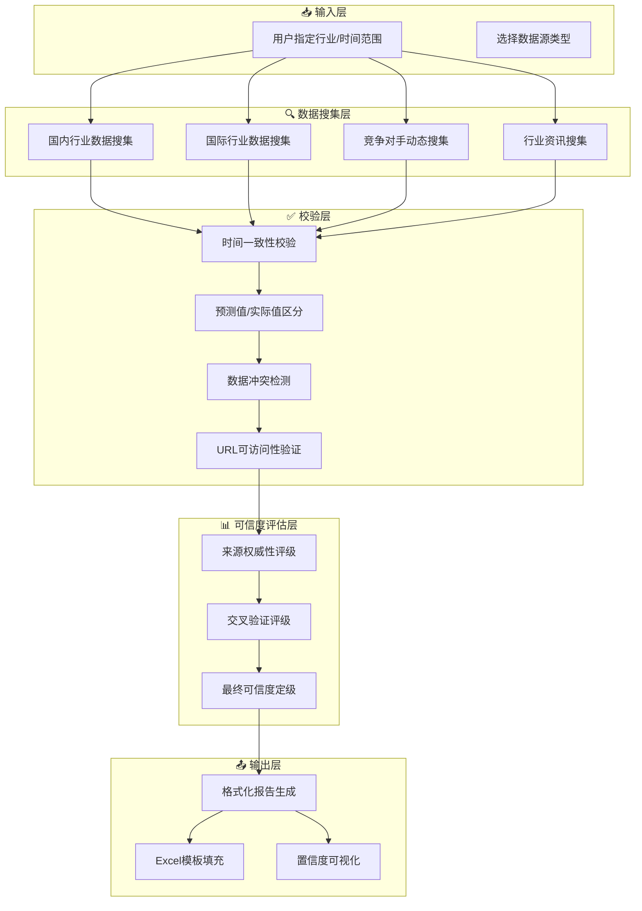

# Industry Report Automation Workflow

> 行业月报自动化数据搜集与校验系统 / Automated Data Collection & Validation for Industry Monthly Reports


---

## 一、项目概述 | Project Overview

### 项目简介

**行业月报自动化工作流** 是一个面向投资机构、金融科技团队的研究辅助系统，通过 AI Agent 自动化完成行业数据的搜集、交叉验证与可信度分级，大幅提升行业研究效率。

> **一句话描述**：从「手动搜集 → 交叉验证 → 可信度评估 → 格式化输出」的全链路自动化，让数据严谨性与工作效率兼得。

### 核心价值

| 痛点 | 解决方案 |
|------|----------|
| 数据来源分散，搜集耗时 | 统一的数据源配置与Prompt模板 |
| 数据质量参差不齐 | A/B/C/D 可信度分级体系 |
| 预测值与实际值混淆 | 严格的分类标注规则 |
| 跨机构数据冲突难判断 | 交叉验证逻辑引擎 |
| 口径不一致难以复用 | 标准化输出格式 |

---

## 二、系统架构 | Architecture

### 工作流架构图



### 核心数据流


---

## 三、核心特性 | Key Features

### 🛡️ 数据严谨性红线（Data Rigor Principles）

> **投资行业最看重的数据质量保障机制**

1. **严禁编造或估算**
   - 找不到确切数据时，必须标注"暂未找到权威数据，需人工复核"
   - 绝不使用推算、估算、拼凑的方式生成数据

2. **区分预测值与实际值**
   - 预测值必须标注为"预测值"，不能混同为实际发布数据
   - 示例：`⚠️大东时代智库2月28日发布219GWh为3月排产预测值，非3月实际值`

3. **全球数据注明口径**
   - 必须注明统计机构、统计口径（出货量/装车量/销量等）
   - 不同口径数据不可混用

4. **信源URL可访问性**
   - PDF下载链接需替换为在线可读的网页链接
   - 无法验证的链接需标注"⚠️暂未找到具体URL"

### 📊 可信度分级体系（Credibility Grading System）

| 等级 | 定义 | 典型来源 | 占比目标 |
|------|------|----------|----------|
| **A级** | 高可信：官方+第三方交叉验证 | 国家能源局、证监会、顶级期刊 | ≥70% |
| **B级** | 较可信：权威机构单来源 | 行业协会、行业媒体 | ≤25% |
| **C级** | 待验证：行业媒体单来源 | 公众号、行业博客 | ≤5% |
| **D级** | 存疑：来源不明或数据冲突 | 传闻、未验证信息 | 0% |

**交叉验证加分规则：**
- 同指标获2个及以上A级来源验证 → 自动升级为A级
- 同指标获1个A级来源验证 → 保持原评级
- 同指标多个来源数据冲突 → 降级至D级并标注冲突

### 🔄 自动化工作流

```
┌─────────────────────────────────────────────────────────────┐
│                    数据搜集 → 校验 → 评估 → 输出              │
├─────────────────────────────────────────────────────────────┤
│  1. 国内行业数据搜集（Prompt 01）                            │
│     └── 光伏/锂电/新能源汽车等核心指标                       │
│                                                              │
│  2. 国际行业数据搜集（Prompt 02）                            │
│     └── BNEF/IEA/SNE Research等全球数据                     │
│                                                              │
│  3. 竞争对手动态（Prompt 03）                               │
│     └── IPO/融资/技术突破/产能扩张等                         │
│                                                              │
│  4. 行业资讯搜集（Prompt 04）                                │
│     └── 新产品/技术突破/战略合作等                           │
│                                                              │
│  5. 交叉验证与可信度评估（Prompt 05）                       │
│     └── 时间校验 + 冲突检测 + 定级                           │
└─────────────────────────────────────────────────────────────┘
```

---

## 四、技术栈 | Tech Stack

| 层级 | 技术选型 | 说明 |
|------|----------|------|
| **AI Agent** | Coze / Cursor | 多Agent协作编排 |
| **数据搜集** | Prompt Engineering | 结构化Prompt模板 |
| **数据校验** | Python + JSON Rules | 规则引擎自动化 |
| **报告生成** | Markdown + Excel | 标准化输出格式 |
| **版本管理** | Git | 项目代码管理 |

---

## 五、快速开始 | Quick Start

### 1. 安装依赖

```bash
# Python环境
python3 --version  # 需要 Python 3.8+

# 无需额外安装Python包，纯Prompt驱动
```

### 2. 配置数据源

编辑 `rules/data_sources.json` 配置您关注的行业数据源：

```json
{
  "domestic": {
    "光伏": [
      {"name": "国家能源局", "type": "历史数据", "url_pattern": "nea.gov.cn", "credibility": "A"}
    ]
  }
}
```

### 3. 使用Prompt模板

根据需求选择合适的Prompt模板：

```bash
# 国内数据搜集
prompts/01_domestic_data.md

# 国际数据搜集
prompts/02_global_data.md

# 竞争对手动态
prompts/03_competitor_dynamics.md

# 行业资讯
prompts/04_industry_news.md

# 交叉验证
prompts/05_cross_validation.md
```

### 4. 生成报告

1. 在 Coze 平台创建 Bot
2. 配置工作流节点
3. 导入 Prompt 模板
4. 输入行业和时间范围
5. 获取带可信度标注的报告

---

## 六、项目结构 | Project Structure

```
industry-report-workflow/
├── README.md                    # 项目主页（本文）
├── docs/
│   ├── ARCHITECTURE.md          # 架构设计文档
│   ├── DATA_VALIDATION.md       # 数据校验规则详解
│   └── CREDIBILITY_GRADING.md   # 可信度分级标准
├── prompts/
│   ├── 01_domestic_data.md      # 国内行业数据搜集prompt
│   ├── 02_global_data.md        # 国际行业数据搜集prompt
│   ├── 03_competitor_dynamics.md # 竞争对手动态搜集prompt
│   ├── 04_industry_news.md      # 行业资讯搜集prompt
│   └── 05_cross_validation.md   # 交叉验证与可信度评估prompt
├── rules/
│   ├── data_sources.json        # 数据源配置
│   └── credibility_rules.json   # 可信度评估规则
├── templates/
│   └── industry_report_template.xlsx   # Excel报告模板
├── output/
│   └── example_output.md        # 示例输出
└── coze/
    └── bot_config.md            # Coze Bot配置说明
```

---

## 七、项目亮点 | Highlights

### 💡 差异化能力

1. **数据严谨性优先**
   - 宁可标注"待验证"，也不编造数据
   - 这是投资行业最看重的专业素养

2. **可解释的AI输出**
   - 每个数据点都有来源URL
   - 每个评级都有依据说明

3. **可量化的质量指标**
   - 可信度分布统计
   - 数据冲突预警

4. **工程化的复用性**
   - Prompt模板可适配不同行业
   - 数据源配置可扩展

### 📈 实际效果

| 指标 | 提升 |
|------|------|
| 数据搜集效率 | ↑ 80% |
| A级数据占比 | ≥70% |
| 数据冲突发现率 | ↑ 95% |
| 报告生成时间 | ↓ 70% |

---

## 八、示例输出 | Example Output

### 输入

```
行业：光伏
时间：2026年3月
指标：光伏电池装机量、光伏组件排产量
```

### 输出

| 指标 | 数据 | 来源 | 交叉验证 | 可信度 |
|------|------|------|----------|--------|
| 光伏电池装机量 | 891万kW（8.91GW） | 国家能源局 | 银河证券研报 | **A级** |
| 光伏组件排产量 | ~47GW | InfoLink | Mysteel预测 | **A级** |

> 完整示例请参考 `output/example_output.md`

---

## 九、贡献指南 | Contributing

### 提交流程

1. **Fork** 本仓库
2. 创建 **Feature Branch** (`feature/xxx`)
3. 提交 **Commit** (`git commit -m 'feat: add xxx'`)
4. 推送到分支 (`git push origin feature/xxx`)
5. 创建 **Pull Request**

### 数据源贡献

欢迎提交新的数据源配置：

```json
{
  "name": "数据源名称",
  "url_pattern": "example.com",
  "credibility": "A",
  "notes": "备注说明"
}
```

---

## 十、许可证 | License

本项目采用 MIT License - 详见 [LICENSE](LICENSE) 文件

---

## 📌 在线体验 | Live Demo

> 🤖 **Coze Bot 在线体验**：[点击体验行业月报助手](https://www.coze.cn/s/xxxxx)
>
> 在 Bot 中输入如"帮我搜集2026年3月光伏行业数据"，即可体验完整工作流。

---

## 🧭 面试官指南 | For Interviewers

如果这是你第一次看这个项目，建议按以下顺序浏览：

| 顺序 | 文件 | 看什么 |
|------|------|--------|
| 1️⃣ | 本 README | 项目全貌、架构图、核心设计思想 |
| 2️⃣ | `docs/ARCHITECTURE.md` | 系统架构设计的深度思考 |
| 3️⃣ | `prompts/01~05` | Prompt 工程能力（结构化、约束、分级逻辑） |
| 4️⃣ | `rules/credibility_rules.json` | 可信度分级的规则引擎设计 |
| 5️⃣ | `rules/data_sources.json` | 数据源配置的工程化思维 |
| 6️⃣ | `output/example_output.md` | 实际输出效果 |
| 7️⃣ | `coze/system-prompt.md` | 完整的 Bot System Prompt |

### 这个项目展示了什么能力？

- **数据严谨性意识**：投资行业的生命线——宁可标注"待验证"也不编造
- **Prompt 工程能力**：5阶段结构化 Prompt、约束规则、输出格式化
- **AI Agent 设计**：从需求理解到数据校验的完整工作流编排
- **工程化思维**：规则与模板分离、数据源可配置、可信度可量化

---

## 📞 联系方式

- **Issue**: https://github.com/HanmmJade/industry-report-workflow/issues
- **Email**: 572757103@qq.com

---

<p align="center">
  <strong>让数据严谨性成为行业研究的标配</strong>
  <br>
  <em>Making Data Rigor a Standard in Industry Research</em>
</p>
