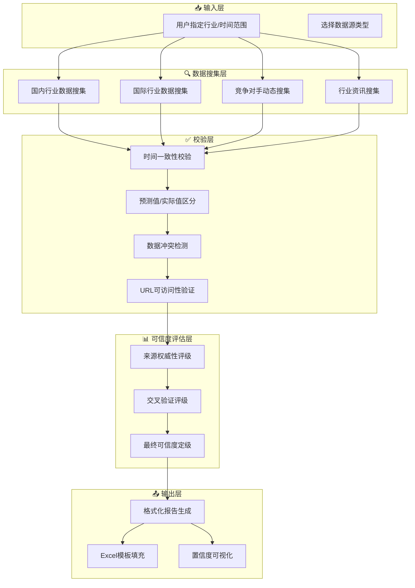
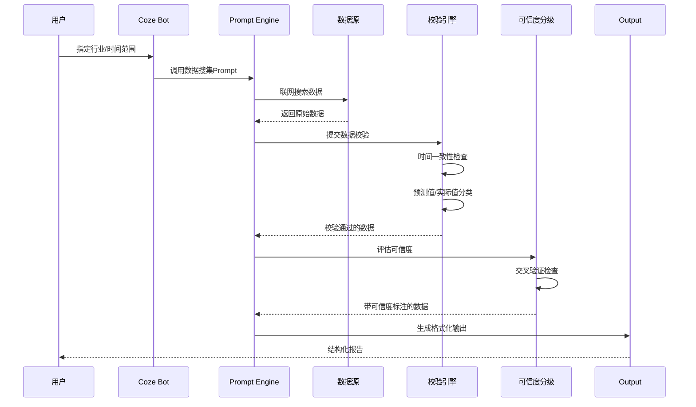

# Industry Report Automation Workflow

> 行业月报自动化数据搜集与校验系统 / Automated Data Collection & Validation for Industry Monthly Reports


---

## 一、项目概述 | Project Overview

### 项目简介

**行业月报自动化工作流** 是一个面向投资机构、金融科技团队的研究辅助系统，通过 AI Agent 自动化完成行业数据的搜集、交叉验证与可信度分级，大幅提升行业研究效率。

> **一句话描述**：从「手动搜集 → 交叉验证 → 可信度评估 → 格式化输出」的全链路自动化，让数据严谨性与工作效率兼得。

### 核心价值

| 痛点 | 解决方案 |
|------|----------|
| 数据来源分散，搜集耗时 | 统一的数据源配置与Prompt模板 |
| 数据质量参差不齐 | A/B/C/D 可信度分级体系 |
| 预测值与实际值混淆 | 严格的分类标注规则 |
| 跨机构数据冲突难判断 | 交叉验证逻辑引擎 |
| 口径不一致难以复用 | 标准化输出格式 |

---

## 二、系统架构 | Architecture

### 工作流架构图



### 核心数据流



---

## 三、核心特性 | Key Features

### 🛡️ 数据严谨性红线（Data Rigor Principles）

> **投资行业最看重，数据质量保障机制**

1. **严禁编造或估算**
   - 找不到确切数据时，必须标注"暂未找到权威数据，需人工复核"
   - 绝不使用推算、估算、拼凑的方式生成数据

2. **区分预测值与实际值**
   - 预测值必须标注为"预测值"，不能混同为实际发布数据
   - 示例：`⚠️大东时代智库2月28日发布219GWh为3月排产预测值，非3月实际值`

3. **全球数据注明口径**
   - 必须注明统计机构、统计口径（出货量/装车量/销量等）
   - 不同口径数据不可混用

4. **信源URL可访问性**
   - PDF下载链接需替换为在线可读的网页链接
   - 无法验证的链接需标注"⚠️暂未找到具体URL"

### 📊 可信度分级体系（Credibility Grading System）

| 等级 | 定义 | 典型来源 | 占比目标 |
|------|------|----------|----------|
| **A级** | 高可信：官方+第三方交叉验证 | 国家能源局、证监会、顶级期刊 | ≥70% |
| **B级** | 较可信：权威机构单来源 | 行业协会、行业媒体 | ≤25% |
| **C级** | 待验证：行业媒体单来源 | 公众号、行业博客 | ≤5% |
| **D级** | 存疑：来源不明或数据冲突 | 传闻、未验证信息 | 0% |

**交叉验证加分规则：**
- 同指标获2个及以上A级来源验证 → 自动升级为A级
- 同指标获1个A级来源验证 → 保持原评级
- 同指标多个来源数据冲突 → 降级至D级并标注冲突

---

## 四、技术实现 | Technical Implementation

### Python代码架构

```
src/
├── data_models.py      # 数据模型定义（dataclass）
├── data_sources.py     # 数据源配置管理
├── validator.py        # 数据校验引擎
├── grader.py           # 可信度分级引擎
├── pipeline.py         # 工作流Pipeline
├── report_generator.py # 报告生成器
└── main.py             # CLI入口
```

### 核心模块说明

#### 1. 数据模型 (data_models.py)
- `DomesticDataPoint`: 国内行业数据
- `GlobalDataPoint`: 国际行业数据
- `CompetitorEvent`: 竞争对手动态
- `IndustryNews`: 行业资讯
- `ValidationResult`: 校验结果
- `GradingResult`: 评级结果
- `PipelineContext`: Pipeline执行上下文

#### 2. 校验引擎 (validator.py)
- `check_time_consistency()`: 时间一致性检查
- `check_forecast_flag()`: 预测值标注检测
- `detect_conflicts()`: 数据冲突检测
- `validate_urls()`: URL可访问性验证

#### 3. 分级引擎 (grader.py)
- 基于来源的预评级（A/B/C/D）
- 交叉验证升级逻辑
- 校验异常降级逻辑
- 批量评级统计

#### 4. Pipeline (pipeline.py)
- 5阶段串联：理解需求 → 收集数据 → 校验 → 分级 → 输出
- 阶段间状态传递
- 错误处理与恢复
- `run_demo()`: 使用示例数据演示

---

## 五、Coze工作流编排 | Coze Workflow Orchestration

### 工作流模式 vs 单Agent模式

| 维度 | 单Agent模式 | 工作流模式（推荐） |
|------|-----------|------------------|
| **架构** | 一个Bot + 多段Prompt | 多个节点串联 |
| **数据流** | 全靠Prompt传递 | 显式节点间传递 |
| **执行确定性** | 依赖LLM理解 | 规则引擎执行 |
| **代码执行** | 无 | 代码节点可执行Python |

### 工作流节点设计

```
┌─────────────┐
│  节点1:开始  │  用户输入
└──────┬──────┘
       │ 并行执行
       ▼
┌──────────────────────────────────────────────────────────┐
│  节点2-5: 数据搜集（LLM节点）                            │
│  ├── 国内数据  ├── 国际数据  ├── 竞对动态  └── 行业资讯  │
└──────┬──────────────────────────────────────────────────┘
       │ 串行执行
       ▼
┌──────────────────────────────────────────────────────────┐
│  节点6: 数据合并（代码节点）                              │
│  节点7: 校验引擎（代码节点）                             │
│  节点8: 可信度分级（代码节点）                           │
│  节点9: 报告生成（LLM节点）                             │
└──────┬──────────────────────────────────────────────────┘
       │
       ▼
┌─────────────┐
│  节点10:结束 │  输出报告
└─────────────┘
```

详细设计见：[coze/workflow_design.md](coze/workflow_design.md)

---

## 六、技术栈 | Tech Stack

| 层级 | 技术选型 | 说明 |
|------|----------|------|
| **AI Agent** | Coze | 工作流编排平台 |
| **数据搜集** | Prompt Engineering | 结构化Prompt模板 |
| **数据校验** | Python + JSON Rules | 规则引擎自动化 |
| **测试框架** | pytest | 单元测试覆盖 |
| **报告生成** | Markdown + Excel | 标准化输出格式 |
| **版本管理** | Git | 项目代码管理 |

---

## 七、快速开始 | Quick Start

### 1. 安装依赖

```bash
cd industry-report-workflow
pip install -r requirements.txt
```

### 2. 运行演示

```bash
python src/main.py --demo
```

### 3. CLI模式

```bash
# 指定行业、时间和数据类型
python src/main.py --industry 光伏 --period 2026年3月 --types domestic,competitor

# 输出Markdown报告
python src/main.py --industry 锂电 --period 2026年4月 --format markdown

# 从JSON文件读取数据
python src/main.py --input data.json --output report.md
```

### 4. 运行测试

```bash
pytest tests/ -v
```

---

## 八、项目结构 | Project Structure

```
industry-report-workflow/
├── README.md                    # 项目主页（本文）
├── docs/
│   ├── ARCHITECTURE.md          # 架构设计文档
│   ├── DATA_VALIDATION.md       # 数据校验规则详解
│   └── CREDIBILITY_GRADING.md  # 可信度分级标准
├── prompts/
│   ├── 01_domestic_data.md      # 国内行业数据搜集prompt
│   ├── 02_global_data.md        # 国际行业数据搜集prompt
│   ├── 03_competitor_dynamics.md # 竞争对手动态搜集prompt
│   ├── 04_industry_news.md      # 行业资讯搜集prompt
│   └── 05_cross_validation.md  # 交叉验证与可信度评估prompt
├── rules/
│   ├── data_sources.json        # 数据源配置
│   └── credibility_rules.json   # 可信度评估规则
├── src/                         # Python代码（新增）
│   ├── data_models.py           # 数据模型
│   ├── data_sources.py          # 数据源管理
│   ├── validator.py             # 校验引擎
│   ├── grader.py                # 分级引擎
│   ├── pipeline.py              # 工作流Pipeline
│   ├── report_generator.py      # 报告生成器
│   └── main.py                  # CLI入口
├── tests/                       # 测试代码（新增）
│   ├── conftest.py              # pytest配置
│   ├── test_validator.py        # 校验引擎测试
│   ├── test_grader.py           # 分级引擎测试
│   ├── test_pipeline.py         # Pipeline测试
│   └── test_data_sources.py     # 数据源测试
├── coze/                        # Coze工作流配置（新增）
│   ├── workflow_design.md       # 工作流设计文档
│   ├── workflow_config.json     # 工作流配置
│   ├── workflow_nodes/          # 代码节点脚本
│   │   ├── merge_data.py        # 数据合并
│   │   ├── validate.py          # 校验引擎
│   │   ├── grade.py             # 分级引擎
│   │   └── format_output.py     # 输出格式化
│   ├── bot_config.md            # Bot配置说明
│   └── system-prompt.md         # System Prompt
├── templates/
│   └── industry_report_template.xlsx   # Excel报告模板
├── output/
│   └── example_output.md        # 示例输出
└── requirements.txt             # Python依赖（新增）
```

---

## 九、面试官指南 | Interviewer's Guide

### 代码文件浏览顺序

1. **快速了解功能** → `README.md`（本文档）
2. **理解数据模型** → `src/data_models.py`
3. **理解校验逻辑** → `src/validator.py`
4. **理解分级逻辑** → `src/grader.py`
5. **理解整体流程** → `src/pipeline.py`
6. **理解输出格式** → `src/report_generator.py`
7. **查看测试覆盖** → `tests/`
8. **了解Coze工作流** → `coze/workflow_design.md`

### 展示要点

1. **工程化思维**：从纯Prompt到Python代码的演进
2. **规则引擎设计**：数据校验和分级的可配置化
3. **测试覆盖**：pytest单元测试保证代码质量
4. **Coze工作流**：多节点编排的设计思路
5. **数据严谨性**：投资行业数据的质量保障机制

---

## 十、项目亮点 | Highlights

### 💡 差异化能力

1. **数据严谨性优先**
   - 宁可标注"待验证"，也不编造数据
   - 这是投资行业最看重的专业素养

2. **可解释的AI输出**
   - 每个数据点都有来源URL
   - 每个评级都有依据说明

3. **可量化的质量指标**
   - 可信度分布统计
   - 数据冲突预警

4. **工程化的复用性**
   - Prompt模板可适配不同行业
   - 数据源配置可扩展
   - Python代码可独立运行
