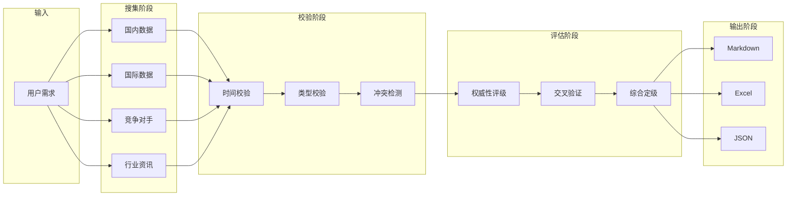

# 架构设计文档 | Architecture Design

> 本文档详细描述行业月报自动化工作流的技术架构、数据流设计与模块职责。

---

## 一、整体架构

### 1.1 系统分层

```
┌─────────────────────────────────────────────────────────────┐
│                        表现层 (Presentation)                │
│    ┌─────────────┐  ┌─────────────┐  ┌─────────────┐     │
│    │   Coze Bot  │  │  Excel模板  │  │  Markdown    │     │
│    └─────────────┘  └─────────────┘  └─────────────┘     │
├─────────────────────────────────────────────────────────────┤
│                        业务层 (Business)                    │
│    ┌─────────────┐  ┌─────────────┐  ┌─────────────┐     │
│    │ 数据搜集引擎 │  │ 校验引擎   │  │ 可信度评估  │     │
│    └─────────────┘  └─────────────┘  └─────────────┘     │
├─────────────────────────────────────────────────────────────┤
│                        规则层 (Rules)                        │
│    ┌─────────────┐  ┌─────────────┐                        │
│    │ 数据源配置  │  │ 可信度规则  │                        │
│    └─────────────┘  └─────────────┘                        │
├─────────────────────────────────────────────────────────────┤
│                        数据层 (Data)                         │
│    ┌─────────────┐  ┌─────────────┐                        │
│    │ Prompt模板  │  │ 行业数据    │                        │
│    └─────────────┘  └─────────────┘                        │
└─────────────────────────────────────────────────────────────┘
```

### 1.2 核心模块职责

| 模块 | 职责 | 输入 | 输出 |
|------|------|------|------|
| **数据搜集引擎** | 调用AI Agent搜集数据 | 行业/时间范围 | 原始数据集合 |
| **校验引擎** | 时间一致性、预测值/实际值区分 | 原始数据 | 校验后数据 |
| **可信度评估** | 评级与交叉验证 | 校验后数据 | 带可信度标注的数据 |
| **报告生成** | 格式化输出 | 评估后数据 | Markdown/Excel |

---

## 二、数据流设计

### 2.1 主数据流



### 2.2 数据传递格式

```json
{
  "data_item": {
    "id": "uuid-xxx",
    "indicator": "光伏电池装机量",
    "value": "891万kW",
    "unit": "万千瓦",
    "time_period": "2026年3月",
    "source": {
      "name": "国家能源局",
      "url": "https://www.nea.gov.cn/xxx",
      "publish_date": "2026-04-23"
    },
    "cross_validation": [
      {
        "source": "银河证券研报",
        "value": "~890万kW"
      }
    ],
    "credibility": {
      "grade": "A",
      "reason": "官方数据+第三方交叉验证一致",
      "upgrade_potential": null
    },
    "validation": {
      "time_consistent": true,
      "is_forecast": false,
      "conflict_detected": false
    },
    "metadata": {
      "created_at": "2026-05-01T10:00:00Z",
      "version": "1.0"
    }
  }
}
```

---

## 三、各模块详细设计

### 3.1 数据搜集引擎

**职责：**
- 调用结构化Prompt获取多维度数据
- 支持国内/国际/竞争对手/行业资讯四类数据
- 返回标准化JSON格式数据

**Prompt配置：**
```yaml
搜集引擎配置:
  temperature: 0.3  # 较低随机性，保证数据准确性
  max_tokens: 4000
  system_prompt: "你是一个专业的行业数据分析师..."
  retry: 3          # 失败重试次数
```

### 3.2 校验引擎

**职责：**
- 时间一致性校验（发布时间必须在数据月份之后）
- 预测值与实际值区分
- 数据冲突检测

**校验规则：**

| 校验项 | 规则 | 违规处理 |
|--------|------|----------|
| 时间一致性 | `publish_date > data_month` | 标记⚠️，数据降级 |
| 预测值标注 | 明确标注"预测值" | 强制标注，否则拒绝 |
| 冲突检测 | 同指标多源差异>10% | 标记冲突，待人工确认 |

### 3.3 可信度评估

**职责：**
- 基于规则引擎进行自动化评级
- 交叉验证逻辑
- 异常数据预警

**评级决策树：**

```
输入数据
    │
    ▼
是否官方来源?
    ├── 是 → 是否有多源验证?
    │       ├── 是 → 评级=A
    │       └── 否 → 评级=B
    │
    ├── 否 → 是否权威机构?
    │       ├── 是 → 评级=B
    │       └── 否 → 评级=C
    │
    └── 来源不明 → 评级=D
```

---

## 四、错误处理策略

### 4.1 数据缺失Fallback

| 场景 | Fallback策略 |
|------|--------------|
| 数据源不可访问 | 尝试备用数据源，记录原因为"⚠️暂未找到" |
| 多源数据冲突 | 保留所有来源，标记"D级"，附注冲突说明 |
| 发布时间异常 | 优先使用官方发布时间，降级处理 |

### 4.2 异常处理流程

```mermaid
flowchart TD
    A[数据获取请求] --> B{请求成功?}
    B -->|否| C[检查错误类型]
    B -->|是| D[数据有效?}
    C -->|网络错误| E[重试3次]
    C -->|权限错误| F[记录并跳过]
    C -->|其他错误| G[记录错误日志]
    E --> H{重试成功?}
    H -->|是| D
    H -->|否| I[使用备用数据源]
    D -->|无效| J[数据校验失败]
    D -->|有效| K[继续流程]
    J --> L[记录失败原因]
    L --> I
    I --> K
    K --> M[流程结束]
    G --> M
    F --> M
```

### 4.3 降级处理规则

```json
{
  "degradation_rules": [
    {
      "condition": "多源数据冲突",
      "action": "标记D级",
      "message": "⚠️数据存在冲突，请人工核实"
    },
    {
      "condition": "预测值未标注",
      "action": "强制标注",
      "message": "⚠️原数据为预测值，已标注"
    },
    {
      "condition": "发布时间异常",
      "action": "降级处理",
      "message": "⚠️发布时间{date}早于数据周期{period}，已降级"
    }
  ]
}
```

---

## 五、扩展性设计

### 5.1 数据源扩展

新增数据源只需在 `rules/data_sources.json` 中添加配置：

```json
{
  "domestic": {
    "新增行业": [
      {
        "name": "数据源名称",
        "type": "历史数据/预测值",
        "url_pattern": "example.com",
        "credibility": "A/B/C/D"
      }
    ]
  }
}
```

### 5.2 Prompt模板扩展

新行业可复制现有Prompt模板并修改：
1. 复制 `prompts/01_domestic_data.md`
2. 修改行业特定指标
3. 更新数据源配置
4. 测试验证

### 5.3 输出格式扩展

当前支持：
- Markdown
- Excel
- JSON

可通过修改 `rules/output_format.json` 添加新格式：

```json
{
  "output_formats": {
    "markdown": {...},
    "excel": {...},
    "json": {...},
    "pdf": {...}  // 新增
  }
}
```

---

## 六、性能优化

### 6.1 并发搜集策略

```
                    ┌─────────────────┐
                    │   主任务入口    │
                    └────────┬────────┘
                             │
         ┌───────────────────┼───────────────────┐
         ▼                   ▼                   ▼
    ┌─────────┐        ┌─────────┐        ┌─────────┐
    │ 国内数据 │        │ 国际数据 │        │ 竞争对手 │
    │ 并发搜集 │        │ 并发搜集 │        │ 并发搜集 │
    └────┬────┘        └────┬────┘        └────┬────┘
         │                   │                   │
         └───────────────────┼───────────────────┘
                             ▼
                    ┌─────────────────┐
                    │   结果汇总合并   │
                    └─────────────────┘
```

### 6.2 缓存策略

| 数据类型 | 缓存时间 | 说明 |
|----------|----------|------|
| 历史数据 | 永久 | 不变的数据 |
| 月度数据 | 24小时 | 可能有修订 |
| 即时资讯 | 实时 | 实时性要求高 |

---

## 七、部署架构

### 7.1 Coze平台部署

```
┌─────────────────────────────────────────────────────────────┐
│                        Coze 平台                            │
│  ┌──────────────┐  ┌──────────────┐  ┌──────────────┐      │
│  │  Bot 入口    │→ │  工作流编排  │→ │  Prompt 执行 │      │
│  └──────────────┘  └──────────────┘  └──────────────┘      │
└─────────────────────────────────────────────────────────────┘
```

### 7.2 本地开发模式

```bash
# 安装依赖
pip install openai python-dotenv

# 配置环境变量
export OPENAI_API_KEY="your-api-key"

# 运行测试
python tests/test_validation.py
```

---

## 八、版本历史

| 版本 | 日期 | 更新内容 |
|------|------|----------|
| 1.0.0 | 2026-05 | 初始版本发布 |
