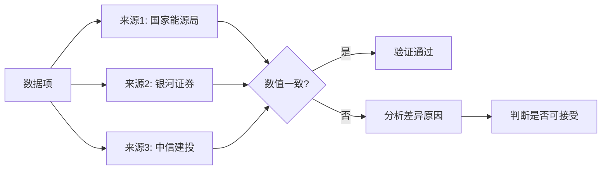
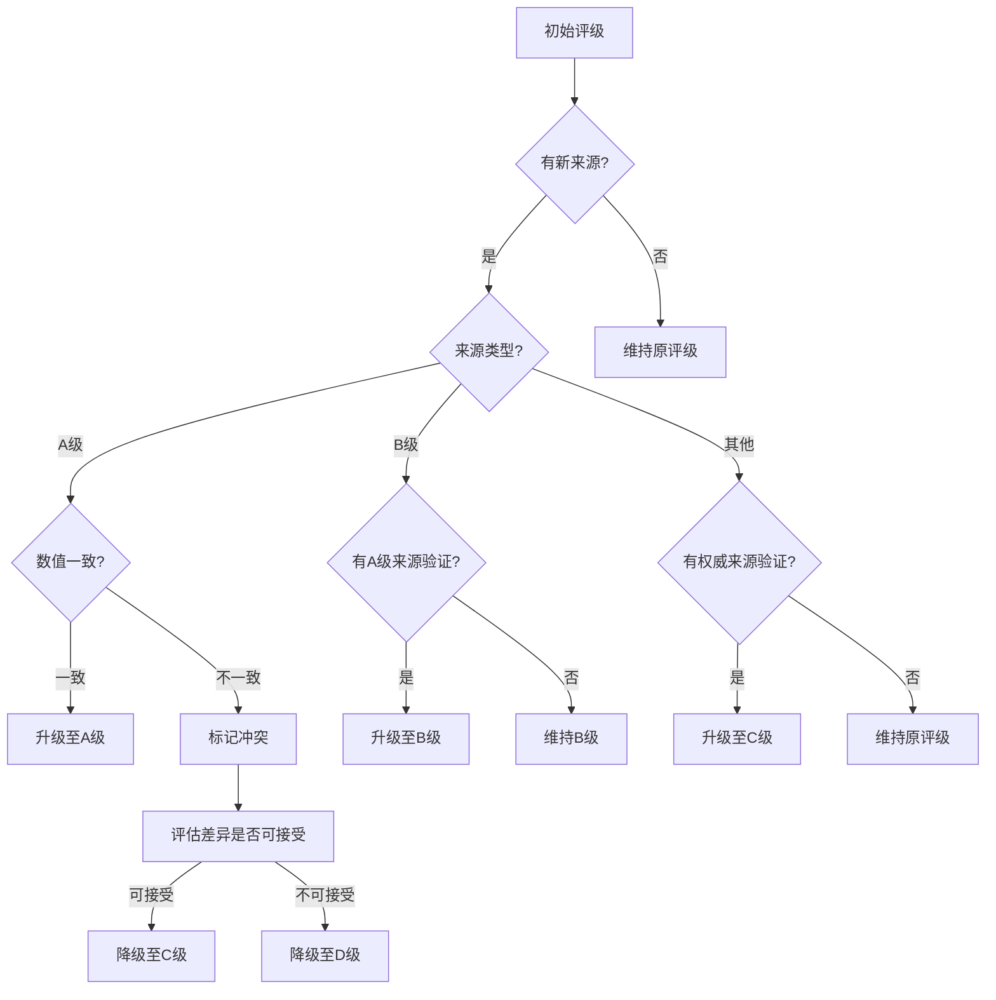

# 可信度分级标准 | Credibility Grading Standards

> 本文档定义行业月报自动化工作流中的数据可信度分级体系，包括分级定义、评级规则、交叉验证方法论及典型案例。

---

## 一、分级体系概述

### 1.1 四级分级标准

| 等级 | 名称 | 定义 | 颜色标识 |
|------|------|------|----------|
| **A级** | 高可信 | 官方来源 + 至少一个第三方交叉验证一致 | 🟢 绿色 |
| **B级** | 较可信 | 权威机构单来源，或官方来源无交叉验证 | 🔵 蓝色 |
| **C级** | 待验证 | 行业媒体单来源，或数据存在轻微不一致 | 🟡 黄色 |
| **D级** | 存疑 | 来源不明、数据冲突严重或无法验证 | 🔴 红色 |

### 1.2 等级分布目标

```
理想分布：
┌─────────────────────────────────────────────────────────────┐
│  A级 ≥70%  │  B级 ≤25%  │  C级 ≤5%  │  D级 0%            │
│  ██████████ │  ████      │  █        │                    │
└─────────────────────────────────────────────────────────────┘

底线分布：
┌─────────────────────────────────────────────────────────────┐
│  A级 ≥50%  │  B级 ≤35%  │  C级 ≤10% │  D级 ≤5%           │
│  ████████  │  ██████    │  ██       │  █                 │
└─────────────────────────────────────────────────────────────┘
```

---

## 二、评级规则详解

### 2.1 A级（高可信）

**定义**：来自权威来源并经交叉验证的数据

**典型来源**：

| 类别 | 来源示例 | 评级说明 |
|------|----------|----------|
| 政府机构 | 国家能源局、国家统计局、证监会 | 发布官方统计数据 |
| 行业协会 | 中国汽车工业协会(CABIA)、CPIA | 发布行业白皮书 |
| 国际机构 | BNEF、IEA PVPS、SNE Research | 发布全球行业数据 |
| 顶级期刊 | Nature、Science | 学术研究成果 |
| 交易所 | 港交所、上交所 | IPO/公告信息 |
| 上市公司 | 年报、公告、财报 | 经审计的财务数据 |

**评级条件**：
```yaml
A级评级必须满足：
1. 来源为上述A类来源之一
2. 至少有一个额外来源进行交叉验证
3. 数据发布时间符合时间一致性要求
4. 无数据冲突或冲突已解决
```

**升级条件**（B→A）：
- 同一指标获得2个及以上A级来源验证
- 示例：国家能源局数据 + 银河证券研报引用

**降级条件**（A→B）：
- 单来源数据，无交叉验证
- 示例：仅有SNE Research数据，无其他来源

### 2.2 B级（较可信）

**定义**：权威机构发布但缺乏交叉验证的数据

**典型来源**：

| 类别 | 来源示例 | 评级说明 |
|------|----------|----------|
| 咨询机构 | Mysteel、InfoLink、EVtank | 行业咨询报告 |
| 券商研报 | 中信证券、国泰君安等 | 研究分析报告 |
| 行业媒体 | 激光制造网、Ofweek | 行业媒体报道 |
| 财经媒体 | 财联社、界面新闻 | 财经新闻报道 |

**评级条件**：
```yaml
B级评级适用：
1. 来源为上述B类来源之一
2. 属于权威机构发布的单来源数据
3. 或A级来源数据但无交叉验证
```

**升级条件**（B→A）：
- 找到额外的A级来源进行交叉验证
- 示例：Mysteel数据 + 国家能源局数据一致

**降级条件**（B→C）：
- 来源为普通行业媒体
- 或发现数据存在不确定性

### 2.3 C级（待验证）

**定义**：行业媒体单来源或数据存在轻微问题

**典型来源**：

| 类别 | 来源示例 | 评级说明 |
|------|----------|----------|
| 公众号 | 行业相关公众号 | 非权威媒体 |
| 博客 | 行业专家博客 | 个人观点 |
| 论坛 | 行业论坛帖子 | 非正式来源 |
| 小众媒体 | 地方性行业媒体 | 影响力有限 |

**评级条件**：
```yaml
C级评级适用：
1. 来源为非权威行业媒体
2. 数据存在轻微不确定性
3. 无法找到交叉验证来源
```

**升级条件**（C→B）：
- 找到权威机构验证
- 示例：公众号信息 + 上市公司公告确认

**降级条件**（C→D）：
- 数据存在明显问题
- 或发现为传闻性质

### 2.4 D级（存疑）

**定义**：来源不明、数据冲突严重或无法验证

**触发条件**：

```yaml
D级评级触发：
1. 来源完全不明
2. 多源数据严重冲突（>10%且无法判断）
3. 数据存在明显错误
4. 传闻性质的信息
```

**处理方式**：
```markdown
D级数据处理：
1. 保留原始信息供人工参考
2. 明确标注问题和原因
3. 建议人工核实后再使用
```

---

## 三、交叉验证方法论

### 3.1 交叉验证定义

**交叉验证**（Cross-Validation）是指通过多个独立来源验证同一数据的准确性和可靠性。



### 3.2 交叉验证类型

| 类型 | 说明 | 验证强度 |
|------|------|----------|
| **直接验证** | 多源数值完全一致 | ⭐⭐⭐⭐⭐ 最强 |
| **间接验证** | 多源趋势一致，数值接近 | ⭐⭐⭐⭐ 强 |
| **弱验证** | 仅有定性一致性 | ⭐⭐⭐ 中等 |
| **单来源** | 无交叉验证 | ⭐ 参考 |

### 3.3 验证加分规则

```json
{
  "cross_validation_rules": {
    "upgrade_conditions": [
      {
        "condition": "同指标2个及以上A级来源验证一致",
        "action": "升级至A级",
        "example": "国家能源局数据 + 银河证券研报"
      },
      {
        "condition": "同指标1个A级来源验证",
        "action": "保持原评级（已是A级则维持）",
        "example": "国家能源局数据"
      }
    ],
    "degrade_conditions": [
      {
        "condition": "多源数据冲突>10%且无法判断",
        "action": "降级至D级",
        "example": "InfoLink vs Mysteel数据差异20%"
      },
      {
        "condition": "发现数据来源不实",
        "action": "降级至D级并标注问题",
        "example": "预测值误标为实际值"
      }
    ]
  }
}
```

### 3.4 验证示例

**示例1：直接验证（升级至A级）**

```markdown
指标：光伏电池装机量

来源1：国家能源局
- 数值：891万kW（8.91GW）
- 发布日期：2026-04-23
- 评级：A级

来源2：数字新能源DNE
- 数值：~890万kW
- 交叉验证：与能源局数据接近
- 评级：A级

最终结果：
✅ 交叉验证通过
✅ 升级至A级
```

**示例2：数值差异处理**

```markdown
指标：光伏组件排产量

来源1：Mysteel（3月10日）
- 数值：39.34GW
- 问题：发布日期3月10日，早于数据周期3月底
- 评级：⚠️预测值

来源2：InfoLink（4月15日）
- 数值：47GW
- 发布日期：4月15日，晚于数据周期
- 评级：A级

最终结果：
⚠️ Mysteel数据为预测值，不可直接对比
✅ 以InfoLink实际值47GW为准
```

---

## 四、升级与降级条件

### 4.1 升级条件汇总

| 条件 | 从 | 到 | 说明 |
|------|----|----|------|
| 2个以上A级来源验证一致 | B | A | 最强验证 |
| 1个A级来源验证 | C | B | 权威验证 |
| 上市公司公告确认 | C | B | 官方确认 |
| 官方修正原数据 | D | C | 来源更正 |

### 4.2 降级条件汇总

| 条件 | 从 | 到 | 说明 |
|------|----|----|------|
| 多源数据严重冲突 | A/B | D | 无法判断 |
| 预测值误标为实际值 | A | C | 标注错误 |
| 发布时间异常 | A/B | B/C | 时间问题 |
| 来源权威性降低 | A/B | B/C | 来源变化 |

### 4.3 动态调整规则



---

## 五、典型案例

### 5.1 A级数据案例

**案例：动力电池装车量**

```markdown
指标：2026年3月中国动力电池装车量

来源1：中国汽车动力电池产业创新联盟（CABIA）
- 数值：56.5 GWh
- 发布日期：2026年4月16日
- 评级：A级

来源2：东方财富网引用
- 交叉验证：数据一致
- 评级：A级

来源3：新浪微博（@中国汽车报）
- 交叉验证：数据一致
- 评级：A级

最终结果：
✅ 三源验证一致
✅ 可信度：A级
```

### 5.2 B级数据案例

**案例：光伏组件排产预测**

```markdown
指标：2026年3月光伏组件排产量

来源1：Mysteel（3月10日）
- 数值：39.34GW（预测值）
- 发布日期：2026-03-10
- 问题：发布日期早于数据周期
- 评级：B级（预测值标注）

来源2：InfoLink（4月15日）
- 数值：47GW（实际值）
- 发布日期：2026-04-15
- 评级：A级

最终结果：
⚠️ Mysteel数据为预测值，不可用于实际数据
✅ 以InfoLink实际值47GW为准
```

### 5.3 C级数据案例

**案例：行业传闻**

```markdown
指标：大族激光苹果3D打印订单

来源1：行业传闻
- 数值：约20亿元
- 问题：规模传闻，无官方确认
- 评级：C级

最终结果：
⚠️ 待验证
备注：建议跟进公司公告确认订单规模
```

### 5.4 D级数据案例

**案例：数据严重冲突**

```markdown
指标：全球新能源车渗透率

来源1：IEA Global EV Outlook 2025
- 数值：>25%（预测值）
- 问题：明确标注为预测值，非实际值
- 评级：⚠️待验证

来源2：EVtank白皮书
- 数值：23.5%（需确认口径）
- 问题：可能与IEA口径不同
- 评级：B级

最终结果：
⚠️ 多源口径不一致
⚠️ 暂无法给出统一数值
建议：需人工复核各来源的具体定义和统计口径
```

---

## 六、可信度报告生成

### 6.1 统计模板

```markdown
## 可信度统计报告

### 整体分布

| 等级 | 数量 | 占比 | 目标 |
|------|------|------|------|
| A级 | XX | XX% | ≥70% |
| B级 | XX | XX% | ≤25% |
| C级 | XX | XX% | ≤5% |
| D级 | XX | XX% | 0% |

### 各分类可信度

| 分类 | A级 | B级 | C级 | D级 |
|------|-----|-----|-----|-----|
| 国内行业数据 | XX | XX | XX | XX |
| 国际行业数据 | XX | XX | XX | XX |
| IPO/融资动态 | XX | XX | XX | XX |
| 技术突破 | XX | XX | XX | XX |
| 竞争对手动态 | XX | XX | XX | XX |

### 建议复核重点

1. ⚠️ [具体待验证项]
2. ⚠️ [具体待验证项]
3. ⚠️ [具体待验证项]
```

---

## 七、规则配置

### 7.1 可信度规则JSON

```json
{
  "credibility_rules": {
    "grade_a": {
      "name": "高可信",
      "criteria": [
        "官方来源（政府/行业协会/顶级期刊）",
        "至少一个第三方交叉验证",
        "时间一致性符合要求",
        "无数据冲突"
      ],
      "weight": 1.0
    },
    "grade_b": {
      "name": "较可信",
      "criteria": [
        "权威机构单来源",
        "或A级来源但无交叉验证"
      ],
      "weight": 0.75
    },
    "grade_c": {
      "name": "待验证",
      "criteria": [
        "行业媒体单来源",
        "或数据存在轻微不确定性"
      ],
      "weight": 0.5
    },
    "grade_d": {
      "name": "存疑",
      "criteria": [
        "来源不明",
        "数据严重冲突",
        "传闻性质"
      ],
      "weight": 0.25
    }
  },
  "cross_validation": {
    "multi_source_bonus": 0.25,
    "conflict_penalty": 0.5,
    "threshold_percent": 10
  }
}
```
