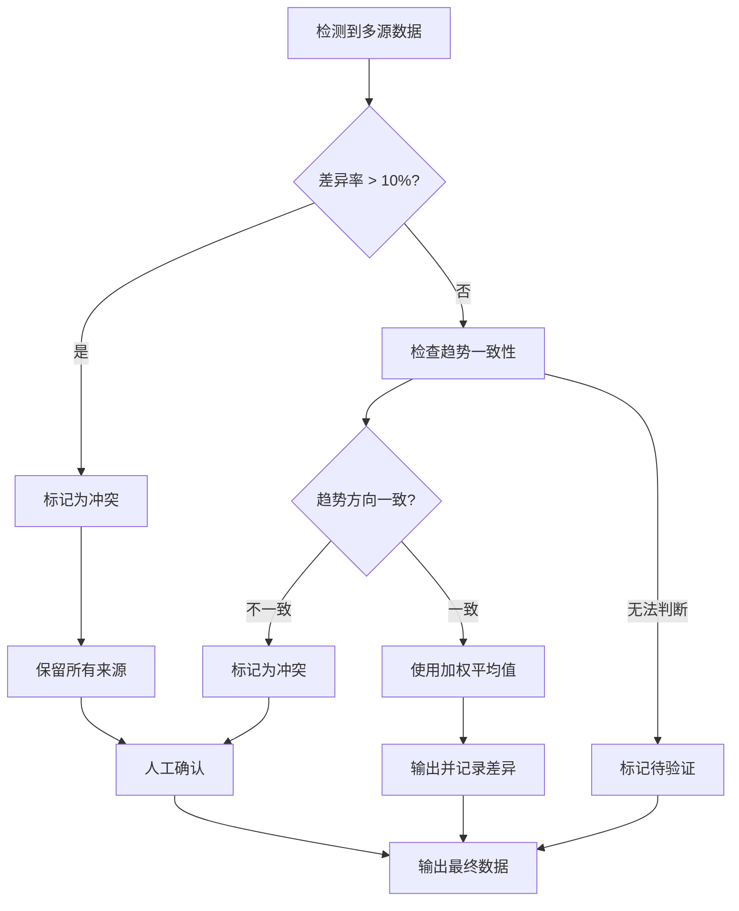
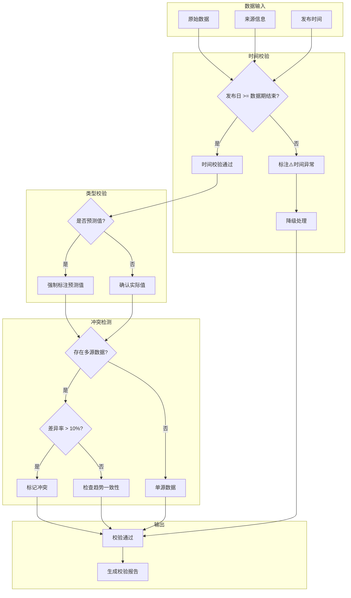

# 数据校验规则详解 | Data Validation Rules

> 本文档详细定义行业月报自动化工作流中的数据校验规则，确保数据质量符合投资行业的严谨性要求。

---

## 一、校验原则

### 1.1 核心原则

| 原则 | 说明 | 优先级 |
|------|------|--------|
| **真实性优先** | 宁可缺失，不可编造 | P0 |
| **可追溯性** | 每个数据点必须可追溯到来源 | P0 |
| **一致性检查** | 时间、口径、定义必须一致 | P1 |
| **冲突预警** | 多源冲突必须显式标注 | P1 |

### 1.2 禁止事项

```yaml
禁止行为:
  - 估算数据: "根据趋势推算约xxx"
  - 拼凑数据: "综合多个来源得出xxx"
  - 模糊标注: "可能/大概/估计是xxx"
  - 混合口径: 将不同口径数据合并
```

---

## 二、时间一致性校验

### 2.1 校验规则

**核心规则**：数据的发布时间必须晚于或等于数据对应的周期。

| 场景 | 规则 | 示例 |
|------|------|------|
| 月度数据 | 发布日需在月末之后 | 3月数据需在4月发布 |
| 季度数据 | 发布日需在季度末之后 | Q1数据需在4月发布 |
| 年度数据 | 发布日需在年末之后 | 2025年数据需在2026年发布 |

**Python伪代码：**

```python
def validate_time_consistency(data_item):
    data_period = data_item['time_period']  # 如 "2026年3月"
    publish_date = data_item['source']['publish_date']
    
    # 计算数据周期的结束日期
    period_end = get_period_end(data_period)
    
    if publish_date < period_end:
        return {
            'valid': False,
            'error': f'发布时间{publish_date}早于数据周期结束{period_end}',
            'action': '降级处理并标注⚠️'
        }
    return {'valid': True}
```

### 2.2 异常处理

| 异常类型 | 处理方式 | 备注 |
|----------|----------|------|
| 发布日早于数据期 | 降级至B级，标注⚠️ | 可能为预发布 |
| 发布日缺失 | 尝试推断，无法推断则标注待验证 | 需人工补充 |
| 日期格式不统一 | 标准化处理 | 统一为YYYY-MM-DD |

### 2.3 典型案例

**案例1：预测值误当实际值**

```markdown
❌ 错误示例：
- 数据：3月光伏组件排产量39.34GW
- 来源：Mysteel（3月10日文章）
- 问题：3月10日发布的文章不可能包含3月全月数据

✅ 正确处理：
- 数据：3月光伏组件排产量47GW（实际值）
- 来源：InfoLink（4月15日发布）
- 标注：⚠️原Mysteel数据为3月10日预测值，已修正为InfoLink实际值
```

**案例2：预测值标注**

```markdown
❌ 错误示例：
- 数据：锂电排产量219GWh
- 来源：大东时代智库
- 问题：未标注为预测值

✅ 正确处理：
- 数据：⚠️暂未找到权威机构直接发布3月实际值
- 说明：大东时代智库2月28日发布219GWh为3月排产预测值
- 建议：以CABIA实际产量数据177.7GWh为准
```

---

## 三、预测值与实际值区分

### 3.1 区分标准

| 类型 | 定义 | 标注格式 |
|------|------|----------|
| **实际值** | 基于实际发生的数据统计 | 无特殊标注 |
| **预测值** | 基于模型/判断的未来预估 | 必须标注"⚠️预测值" |
| **估算值** | 基于部分数据的推算 | 标注"⚠️估算值" |
| **待验证** | 暂未找到权威来源 | 标注"⚠️待验证" |

### 3.2 预测值判断规则

```yaml
预测值特征:
  - 文章日期早于数据周期
  - 包含"预计/预期/预测/估计"等词汇
  - 数据为整数且无小数位
  - 来源为券商研报或咨询机构
  
实际值特征:
  - 文章日期晚于数据周期
  - 数据精确到小数点后1-2位
  - 来源为官方统计机构
  - 包含"实际/累计/统计"等词汇
```

### 3.3 标注要求

```markdown
预测值必须包含：
1. 原始数据值
2. 预测发布机构
3. 预测发布时间
4. 与实际值的差异（如已知）

示例：
⚠️大东时代智库2月28日发布219GWh为3月排产预测值，非3月实际值；
中国3月动力+储能电池实际产量177.7GWh（CABIA发布）
```

---

## 四、数据冲突检测

### 4.1 冲突定义

当同一指标出现以下情况时，判定为数据冲突：

| 冲突类型 | 定义 | 阈值 |
|----------|------|------|
| 数值冲突 | 多源数值差异超过允许范围 | >10% |
| 趋势冲突 | 多源同比/环比方向相反 | 方向相反 |
| 口径冲突 | 多源统计口径不同 | 不一致 |

### 4.2 冲突处理流程



### 4.3 冲突输出格式

```markdown
⚠️ 数据冲突标注示例：

| 指标 | 来源1 | 来源2 | 差异率 | 处理方式 |
|------|-------|-------|--------|----------|
| 光伏组件排产 | 39.34GW (Mysteel) | 47GW (InfoLink) | 19.5% | ⚠️冲突，已分别列出 |

备注：
- Mysteel数据为3月10日发布的预测值
- InfoLink数据为4月15日发布的实际值
- 建议以InfoLink实际值47GW为准
```

---

## 五、缺失数据处理

### 5.1 缺失类型

| 类型 | 说明 | 处理方式 |
|------|------|----------|
| 完全缺失 | 多个来源均未找到 | 标注"⚠️暂未找到权威数据" |
| 部分缺失 | 某些细分数据缺失 | 标注"部分数据暂未获取" |
| URL缺失 | 有数据但无链接 | 标注"⚠️暂未找到具体URL" |

### 5.2 处理规范

```yaml
缺失数据处理:
  严禁行为:
    - 自行估算或推算
    - 使用相似数据替代
    - 留空不标注
    
  正确做法:
    - 显式标注"⚠️暂未找到"
    - 提供可查阅的建议
    - 记录缺失原因
```

### 5.3 输出示例

```markdown
## 锂电排产量
- **数据值**：⚠️暂未找到权威机构直接发布3月实际值
- **参考数据**：大东时代智库2月28日发布219GWh（预测值）
- **实际数据**：中国3月动力+储能电池实际产量177.7GWh（CABIA发布）
- **建议**：以CABIA实际产量数据为准
```

---

## 六、口径一致性校验

### 6.1 常见口径差异

| 指标 | 常见口径 | 差异说明 |
|------|----------|----------|
| 新能源车销量 | 中汽协/乘联会/交强险 | 乘联会为零售口径，中汽协含出口 |
| 汽车销量 | OICA/乘联会/交强险 | OICA为工厂发货口径 |
| 光伏装机 | 电网/能源局/组件出货 | 存在项目审批与实际安装时差 |
| 电池装车量 | CABIA/SNE Research | 中国数据与全球数据口径不同 |

### 6.2 口径标注要求

```markdown
⚠️ 口径说明示例：

| 来源 | 口径定义 | 数据值 |
|------|----------|--------|
| OICA | 工厂发货口径 | 9647万辆 |
| 乘联会 | 零售口径 | 需另行查询 |

注：各机构统计口径存在差异，OICA数据为工厂发货量，
与零售口径数据不可直接对比。
```

---

## 七、URL可访问性校验

### 7.1 校验标准

| 状态 | 定义 | 处理方式 |
|------|------|----------|
| ✅ 可访问 | URL正常返回内容 | 正常输出 |
| ⚠️ PDF链接 | 下载链接不可直接查看 | 替换为在线页面 |
| ❌ 失效 | 404或无法访问 | 标注并尝试备用链接 |
| 🔍 需登录 | 需要登录才能访问 | 标注"需登录查看" |

### 7.2 URL处理规则

```yaml
URL处理:
  PDF下载链接:
    - 优先替换为引用该PDF的在线文章
    - 如无替代，标注"⚠️PDF下载链接，需下载查看"
    
  失效链接:
    - 尝试搜索更新链接
    - 如无法更新，标注"⚠️原链接已失效，请通过来源名称搜索"
    
  公众号链接:
    - 标注来源公众号名称
    - 提示"链接可能因时效性失效"
```

---

## 八、校验流程图



---

## 九、校验配置

### 9.1 规则配置文件

校验规则通过 `rules/validation_rules.json` 配置：

```json
{
  "validation_rules": {
    "time_consistency": {
      "enabled": true,
      "strict_mode": false,
      "tolerance_days": 0
    },
    "forecast_detection": {
      "enabled": true,
      "keywords": ["预计", "预测", "预期", "估计"],
      "date_threshold_days": 5
    },
    "conflict_detection": {
      "enabled": true,
      "threshold_percent": 10,
      "trend_check": true
    }
  }
}
```

---

## 十、校验示例

### 完整校验流程示例

**输入数据：**
```json
{
  "indicator": "光伏组件排产量",
  "value": "39.34GW",
  "time_period": "2026年3月",
  "source": {
    "name": "Mysteel",
    "url": "https://mysteel.com/article/xxx",
    "publish_date": "2026-03-10"
  }
}
```

**校验过程：**

1. **时间校验**
   - 数据周期：2026年3月
   - 结束日期：2026-03-31
   - 发布日期：2026-03-10
   - 结果：❌ 发布日早于数据周期，降级处理

2. **类型校验**
   - 来源为行业咨询机构
   - 关键词检测：无明确预测词
   - 但日期特征符合预测值模式
   - 结果：⚠️ 需标注为预测值

3. **冲突检测**
   - InfoLink发布4月15日数据：47GW
   - 差异率：(47-39.34)/47 = 16.4%
   - 结果：⚠️ 超过阈值，标记冲突

**最终输出：**
```markdown
## 光伏组件排产量

| 来源 | 数据 | 发布日期 | 可信度 | 备注 |
|------|------|----------|--------|------|
| Mysteel | 39.34GW | 2026-03-10 | ⚠️B级 | ⚠️预测值，3月10日发布不可能包含3月全月数据 |
| InfoLink | 47GW | 2026-04-15 | A级 | 3月组件实际产出，环比提升近35% |

⚠️ 多源冲突：Mysteel数据为预测值，InfoLink数据为实际值，
建议以InfoLink实际值47GW为准。
```
